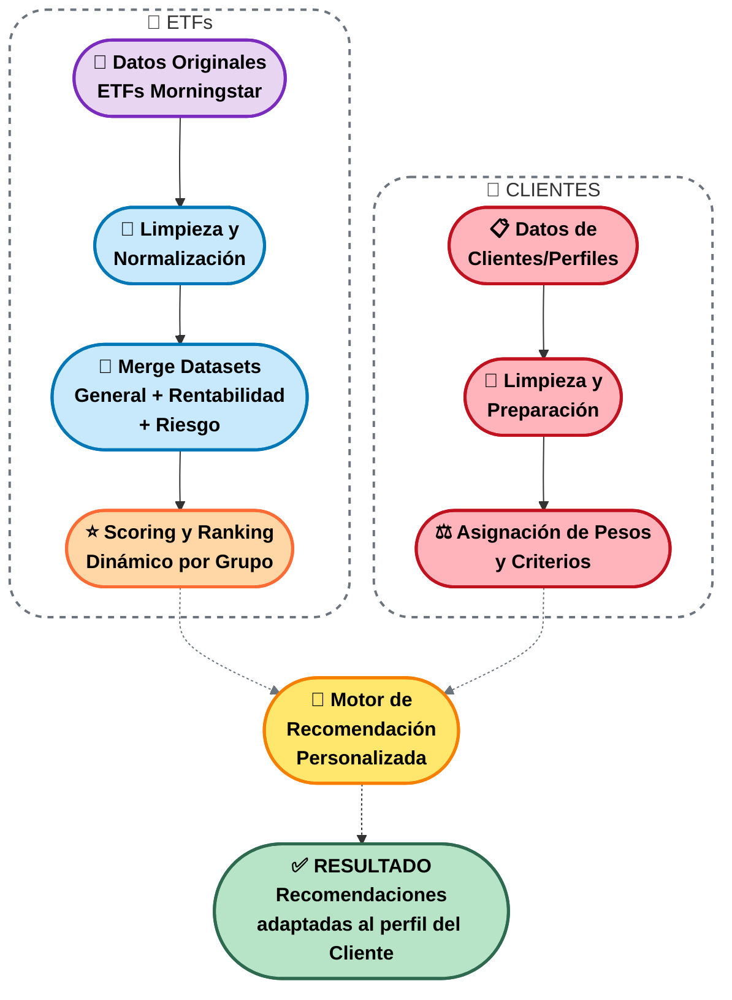

# 💼 INVERSIO : Sistema de Recomendación de ETFs

## 🧩 Descripción General

**Inversio** es una herramienta interactiva que recomienda carteras personalizadas de **ETFs** (Exchange-Traded Funds) adaptadas al perfil de riesgo, horizonte temporal y tolerancia del inversor.  
El sistema combina la extracción automatizada de datos financieros desde *Morningstar* con un proceso de análisis, scoring y recomendación, integrando todos los resultados en una interfaz visual desarrollada con **Streamlit**.  

El objetivo es **democratizar la inversión**, facilitando al usuario decisiones informadas y ajustadas a su perfil, mostrando además proyecciones dinámicas de rentabilidad esperada y evolución temporal de su cartera.

---

## 🎯 Objetivos del Proyecto

- Analizar el comportamiento histórico y las características de diferentes ETFs.  
- Calcular métricas de rendimiento y riesgo para clasificarlos en grupos homogéneos.  
- Desarrollar un motor de recomendación que optimice la relación **rentabilidad-riesgo**.  
- Crear una aplicación visual e interactiva que permita al usuario:
  - Simular aportaciones periódicas.
  - Evaluar la rentabilidad proyectada.
  - Visualizar la composición óptima de su cartera.


---

## 📂 Estructura del Proyecto

```
inversio/         
│
├── assets/
│   └── inversio_logo.png            
│
├── data/
│   ├── clientes/
│   │   ├── clientes_base.csv        
│   │   └── clientes_con_pesos.csv   
│   │
│   ├── etf/
│   │   ├── limpios/
│   │   │   └── etfs.csv             
│   │   └── originales/
│   │       ├── etf_general.csv      
│   │       ├── etf_rentabilidad.csv 
│   │       └── etf_riesgo.csv       
│   │
│   ├── recomendador/
│   │   └── recomendaciones_clientes.csv  
│   │
│   └── score/
│       ├── etfs_scored.csv               
│       └── topN_grupo.csv           
│
├── scripts/
│   │
│   ├── clientes/
│   │   ├── generar_clientes.py      
│   │   └── asignar_pesos.py
│   │
│   ├── etf/
│   │   └── cleaner.py              
│   │
│   ├── recomendador/
│   │   └── recomendador.py
│   │
│   ├── scoring/
│   │   └── scoring_etfs.py
│   │
│   └── scrapers/
│       ├── scraper_general.py       
│       ├── scraper_renta.py         
│       └── scraper_riesgo.py        
│
├── .gitignore
├── inversio_test.py
├── inversio.py
├── README.md
├── requirements.txt
├── run_all.py
└── inversio.py
```

---

## 📊 Datos y Fuentes

- **ETFs:** obtenidos automáticamente mediante *web scrapers* desde [Morningstar](https://www.morningstar.es/), con información de rentabilidad, riesgo y métricas generales.  
- **Clientes:** generados sintéticamente para la demostración del sistema. Incluyen variables como edad, sueldo anual, patrimonio, horizonte temporal y tolerancia al riesgo.

---

## 🏗️ Arquitectura del Sistema


---

## ⚙️ Flujo de Trabajo

1. **Extracción de datos:**  
   Los scripts de `scrapers/` recogen información actualizada sobre los ETFs desde *Morningstar* (general, rentabilidad, riesgo).

2. **Limpieza y consolidación (`cleaner.py`):**  
   Combina los distintos CSVs y genera un dataset limpio único.

3. **Cálculo de puntuaciones (`scoring_etfs.py`):**  
   Evalúa cada ETF en función de su rentabilidad, volatilidad y métricas adicionales, clasificándolos en tres grupos: **bajo, medio y alto riesgo**.

4. **Generación de clientes (`generar_clientes.py`):**  
   Crea una base sintética de inversores para las pruebas.

5. **Asignación de pesos (`asignar_pesos.py`):**  
   Calcula, para cada cliente, la proporción recomendada de inversión en cada grupo de riesgo.

6. **Recomendación final (`recomendador.py`):**  
   Une las puntuaciones de ETFs con los perfiles de clientes y genera las carteras recomendadas personalizadas.

7. **Visualización interactiva (`inversio.py`):**  
   La aplicación en **Streamlit** permite al usuario:
   - Ajustar el monto invertido y el tiempo de inversión.  
   - Observar la rentabilidad proyectada.  
   - Visualizar la distribución de ETFs y el peso de cada activo en la cartera.

---

## 💻 Instalación y Uso

### 1️⃣ Clonar el repositorio

Ve a la ruta en la que quieras guardar el proyecto

```bash
git clone https://github.com/alonsolara/INVERSIO
cd inversio
```

### 2️⃣ Crear entorno virtual (recomendado)

```bash
python -m venv .venv
source .venv/bin/activate  # En Linux/Mac
.venv\Scripts\activate     # En Windows
```

### 3️⃣ Instalar dependencias

```bash
pip install -r requirements.txt
```

### 4️⃣ Ejecutar todos los scripts automáticamente

```bash
python run_all.py
```

### 5️⃣ Lanzar la aplicación

Existen dos versiones:

   - Versión de prueba (inversio_test)  
   Permite probar la aplicación mediante un formulario interactivo, con toda la funcionalidad completa.

```bash
streamlit run app/streamlit/inversio_test.py
```

   - Versión completa (inversio)  
   Muestra todos los datos del proyecto, incluyendo gráficos, carteras y simulaciones, y permite seleccionar clientes específicos.

```bash
streamlit run app/streamlit/inversio.py
```

## 🧠 Tecnologías Principales

| Tecnología | Versión | Propósito |
|------------|---------|-----------|
|  | 3.10+ | Lenguaje base del proyecto |
|  | 4.0+ | Web scraping automatizado |
|  | 2.0+ | Manipulación y análisis de datos |
|  | 1.24+ | Cálculos numéricos |
|  | 1.28+ | Interfaz web interactiva |
|  | 5.0+ | Visualizaciones dinámicas |


## 📚 Créditos y Autoría

- **Autor:** Alonso Lara Ordóñez  
- **Contacto:** [linkedin.com/in/alonsolara/](https://www.linkedin.com/in/alonsolara/)